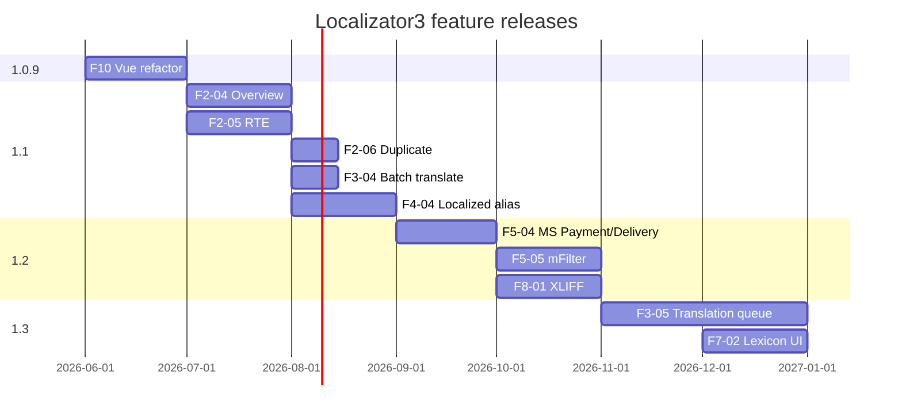

# Roadmap — Localizator3

План развития на основе текущего состояния (**1.0.8-beta**), технического долга и анализа решений в аналогичных CMS.

**Версия:** 1.0.8-beta · [Оглавление документации](./README.md)

**См. также:** [architecture.md](./architecture.md), [changelog](../core/components/localizator3/docs/changelog.txt)

---

## Позиционирование Localizator3

Localizator3 использует модель **«один ресурс — N локализаций полей»** (таблица `localizator3_content`), а не отдельные ресурсы в контекстах (как [Babel](https://docs.modx.com/current/en/extras/babel/index)) и не полное клонирование `modResource` (как [Lingua](https://docs.modx.com/current/en/extras/lingua/index)).

| Модель | Плюсы | Минусы |
|--------|-------|--------|
| **Babel** (ресурс на язык в context) | Разная структура сайта по языкам, независимые alias | Дублирование дерева, сложнее синхронизация |
| **Lingua** (клон content + TV) | Привычная форма ресурса | Нет разной структуры; проблемы с внешними TV |
| **Localizator3** (overlay полей) | Один ID ресурса, Fenom/pdoTools, MS3 | Нет отдельных alias/контекстов «из коробки» |

**Стратегия развития:** усилить сильные стороны overlay-модели (SEO, pdoTools, e-commerce, автоперевод), закрыть пробелы относительно WPML/Polylang/Drupal в **workflow перевода** и **обзоре статусов**, не превращаясь в полный клон Babel.

---

## Сравнительный анализ CMS

### MODX-экосистема

| Решение | Ключевые фичи | Что взять для Localizator3 |
|---------|---------------|----------------------------|
| **[Babel](https://mikrobi.github.io/babel/)** | Связи ресурсов между context; Babel Box переключения; sync TV; автосоздание переводов | Панель связей/статусов; sync «общих» TV; быстрое создание перевода |
| **[Lingua](https://docs.modx.com/current/en/extras/lingua/index)** | Языки без context; cookie/session; клон полей ресурса | Уже близко по модели; усилить cookie/`cultureKey` UX |
| **Localizator (MODX 2)** | Предшественник; проверенные сниппеты | Паритет API, миграция пользователей |

### WordPress

| Решение | Ключевые фичи | Что взять для Localizator3 |
|---------|---------------|----------------------------|
| **[WPML](https://wpml.org/)** | Translation Management; translation memory; очереди; DeepL/Google/Azure; WooCommerce; string translation; media per language | Dashboard переводов; memory; batch jobs; роли переводчика |
| **[Polylang](https://polylang.pro/)** | Лёгкий core; перевод slug; duplicate post; XLIFF; language switcher | Локализованные alias; duplicate localization; import/export XLIFF |
| **Weglot / TranslatePress** | SaaS / visual editing | Не целевой путь (overlay в MODX manager достаточен) |

### Drupal

| Модуль | Ключевые фичи | Что взять для Localizator3 |
|--------|---------------|----------------------------|
| **Content Translation** | Отдельная версия контента на язык; Translate tab | Overview «что переведено» (у нас — compact status table) |
| **Configuration Translation** | Лейблы полей, настройки | Локализация caption TV в форме (частично есть) |
| **Interface Translation** | UI strings + community .po | UI для `mgr/lexicon/*` (процессор есть) |
| **[TMGMT](https://www.drupal.org/project/tmgmt)** | Jobs, провайдеры, review workflow | Очередь переводов, статусы draft/review/published |

### Сводная матрица возможностей

| Фича | Localizator3 | Babel | WPML | Polylang | Drupal |
|------|:------------:|:-----:|:----:|:--------:|:------:|
| CRUD языков | ✅ | ⚙️ context | ✅ | ✅ | ✅ |
| Локализация полей ресурса | ✅ | ✅ отдельный ресурс | ✅ | ✅ | ✅ |
| Локализация TV | ✅ | ✅ + sync | ✅ | ✅ | ✅ |
| Автоперевод (MT) | ✅ | ⚙️ | ✅ | Pro | ⚙️ TMGMT |
| hreflang / canonical / sitemap | ✅ | ⚙️ | ✅ | ✅ | ✅ |
| Language switcher snippet | ✅ | ✅ | ✅ | ✅ | block |
| URL: prefix / subdomain / domain | ✅ host | context | ✅ | ✅ | ✅ |
| **Локализованный alias (slug)** | ❌ | ✅ | ✅ | ✅ | ✅ |
| **Translation overview dashboard** | ❌ | ⚙️ links | ✅ | ⚙️ | ✅ |
| **Translation memory** | ❌ | ❌ | ✅ | ❌ | ⚙️ |
| **XLIFF / CSV export-import** | ❌ | ❌ | ✅ | ✅ Pro | ✅ |
| **Duplicate → новый язык** | ⚙️ SimpleCopy | ✅ create | ✅ | ✅ | ✅ |
| **Bulk translate / queue** | ⚙️ CLI | ❌ | ✅ | ❌ | ✅ TMGMT |
| **Richtext в manager** | ❌ | ✅ native | ✅ | ✅ | ✅ |
| **E-commerce options** | ✅ MS3 | ❌ | ✅ WC | add-on | ⚙️ |
| **Поиск по локали** | ✅ mSearch | ❌ | ⚙️ | ⚙️ | ⚙️ |
| **Sync shared fields** | ❌ | ✅ TV sync | ⚙️ | ❌ | ⚙️ |
| **Translation roles / workflow** | ⚙️ policy | ❌ | ✅ | ❌ | ✅ |

Условные обозначения: ✅ — есть; ❌ — нет; ⚙️ — частично / через интеграцию.

---

## Каталог фич

Фичи сгруппированы по доменам. ID используется в issues/MR и релизах.

**Приоритет:** P0 критично · P1 релиз 1.1–1.2 · P2 средний · P3 backlog  
**Статус:** ✅ done · 🔶 partial · ⬜ planned

---

### F1 — Языки и маршрутизация

| ID | Фича | Статус | P | Референс | Описание |
|----|------|--------|---|----------|----------|
| F1-01 | CRUD языков (key, host, cultureKey, rank) | ✅ | — | Lingua | Страница «Языки», `LanguagesGrid` |
| F1-02 | Определение языка по HTTP host + URL | ✅ | — | Babel router | `OnHandleRequest`, `findLocalization` |
| F1-03 | Cookie / Accept-Language auto-detect | ✅ | — | Polylang | `localizator3_auto_detect_language` |
| F1-04 | Language switcher (`getLanguageList`) | ✅ | — | WPML | list / dropdown, rank sort |
| F1-05 | Drag-and-drop ранжирование языков | ⬜ | P2 | Polylang | DnD на странице «Языки» |
| F1-06 | Валидация уникальности `http_host` | ⬜ | P2 | — | Client + server validation |
| F1-07 | Массовое enable/disable языков | ⬜ | P2 | WPML | Checkbox + bulk actions |
| F1-08 | Context groups (несколько сайтов) | ⬜ | P3 | Babel | Out of scope для overlay-модели; документировать ограничение |

---

### F2 — Локализация контента (manager)

| ID | Фича | Статус | P | Референс | Описание |
|----|------|--------|---|----------|----------|
| F2-01 | Inline-форма на вкладке ресурса | ✅ | — | Drupal Translate tab | Dropdown `activeLanguages`, табы Document/TV |
| F2-02 | Save / enable / delete локализации | ✅ | — | — | Toolbar ContentGrid |
| F2-03 | Кастомизация полей (`OnBuildLocalizationTabs`) | ✅ | — | Drupal | visible, rank, events |
| F2-04 | **Compact overview переводов** | ⬜ | P1 | WPML TM | Таблица: язык · active · % заполненности · дата |
| F2-05 | **Rich text (MODX RTE)** | ⬜ | P1 | Babel native | `which_editor` для content и richtext-TV |
| F2-06 | **Duplicate localization** | ⬜ | P1 | Polylang | «Скопировать с языка X» (SimpleCopy+) |
| F2-07 | **Sync shared TV/fields** | ⬜ | P2 | Babel TV sync | Поля «одинаковые для всех языков» |
| F2-08 | Unsaved changes warning | ⬜ | P2 | WPML | При смене языка в dropdown |
| F2-09 | Фильтр `localizator3_tv_fields` в UI | 🔶 | P2 | — | Backend есть; подсказка в форме |
| F2-10 | Vue composables + декомпозиция | 🔶 | P0 | — | `useConnector` и др. не подключены; gate <400 строк |

---

### F3 — Workflow перевода

| ID | Фича | Статус | P | Референс | Описание |
|----|------|--------|---|----------|----------|
| F3-01 | Автоперевод одной локали | ✅ | — | WPML MT | Yandex, Google, DeepL, LibreTranslate, MyMemory |
| F3-02 | Настройки «только пустые» / «перезаписать» | ✅ | — | WPML | `translate_translated*` settings |
| F3-03 | CLI mass translate | ✅ | — | WPML CLI | `translate_resources.php` |
| F3-04 | **Batch translate (N языков)** | ⬜ | P1 | WPML | Выбор языков → очередь |
| F3-05 | **Translation queue + progress** | ⬜ | P2 | TMGMT | Фоновые jobs, resume, % в UI |
| F3-06 | **Translation memory** | ⬜ | P3 | WPML | Кэш сегментов text→translation |
| F3-07 | **Human review flag** | ⬜ | P3 | Drupal TMGMT | draft / needs_review / approved |
| F3-08 | **Continuous translate on save** | ⬜ | P3 | Evolving Web AI | Опция: автоперевод новых/изменённых полей |
| F3-09 | Роли переводчика (policy) | 🔶 | P2 | WPML | `LocalizatorManagerPolicy`; UI workflow нет |

---

### F4 — SEO и URL

| ID | Фича | Статус | P | Референс | Описание |
|----|------|--------|---|----------|----------|
| F4-01 | hreflang + canonical | ✅ | — | WPML | `getLocalizedCanonical` |
| F4-02 | Multilingual sitemap | ✅ | — | Polylang | `getLocalizedSitemap` |
| F4-03 | 404 без локализации | ✅ | — | — | `localizator3_404_if_no_localization` |
| F4-04 | **Локализованный alias (uri)** | ⬜ | P1 | Polylang | Поле `uri` в `localizator3_content` или override в router |
| F4-05 | **Локализованные meta per language** | 🔶 | P1 | Yoast+WPML | seotitle, keywords есть; UI/validation |
| F4-06 | Hreflang для MS3 категорий | ⬜ | P3 | — | При локализации taxonomy MS3 |

---

### F5 — E-commerce (miniShop3)

| ID | Фича | Статус | P | Референс | Описание |
|----|------|--------|---|----------|----------|
| F5-01 | Локализация msProduct | ✅ | — | WPML WC | Вкладка на товаре |
| F5-02 | locOption / locProductOption | ✅ | — | WC attributes | Fenom + модели |
| F5-03 | getLocalizedResources + msProducts | ✅ | — | — | Сниппет |
| F5-04 | **msPayment / msDelivery** | ⬜ | P1 | WPML WC | name, description |
| F5-05 | **mFilter facets** | ⬜ | P2 | — | locOption в фасетах |
| F5-06 | Локализация msCategory (если MS3) | ⬜ | P3 | WPML | caption/description категорий |

---

### F6 — Поиск и фильтрация

| ID | Фича | Статус | P | Референс | Описание |
|----|------|--------|---|----------|----------|
| F6-01 | mSearch индексация `{key}-{field}` | ✅ | — | — | `mseOnBeforeIndex` |
| F6-02 | Динамический `fields` в mSearchForm | ✅ | — | — | Документировано в integration-msearch |
| F6-03 | Переиндексация при save локализации | 🔶 | P2 | — | Требует save ресурса; hook OnSaveLocalization → mSearch |

---

### F7 — Строки, лексикон, медиа

| ID | Фича | Статус | P | Референс | Описание |
|----|------|--------|---|----------|----------|
| F7-01 | Fenom `locfield` | ✅ | — | — | pdoToolsOnFenomInit |
| F7-02 | **UI перевода лексиконов MODX** | ⬜ | P3 | WPML String | Процессоры `mgr/lexicon/*` без Vue-страницы |
| F7-03 | **Chunk / template string translation** | ⬜ | P3 | Polylang | Список строк namespace → перевод |
| F7-04 | **Media per language (TV image)** | ⬜ | P3 | WPML Media | Разные файлы в image-TV по key |
| F7-05 | Community lexicon export (.po) | ⬜ | P3 | Drupal locale | Экспорт для Weblate (как у Babel) |

---

### F8 — Import / Export и collaboration

| ID | Фича | Статус | P | Референс | Описание |
|----|------|--------|---|----------|----------|
| F8-01 | **XLIFF 1.2 export/import** | ⬜ | P2 | Polylang Pro | Ресурс + TV → XLIFF, обратный импорт |
| F8-02 | **CSV export/import локализаций** | ⬜ | P2 | WPML | Для агентств и Excel-workflow |
| F8-03 | Assign translator (user → language) | ⬜ | P3 | WPML | Ограничение языков по пользователю |
| F8-04 | Webhook OnSaveLocalization | 🔶 | P3 | — | Событие есть; документация + примеры |

---

### F9 — Платформа и developer experience

| ID | Фича | Статус | P | Референс | Описание |
|----|------|--------|---|----------|----------|
| F9-01 | VueTools Import Map + lean bundles | ✅ | — | — | ~14 KB entries |
| F9-02 | События OnBuild*, OnSave*, OnToggle* | ✅ | — | Drupal hooks | CUSTOMIZATION.md |
| F9-03 | REST-like processors mgr/* | ✅ | — | — | api.md |
| F9-04 | VueTools ≥1.1.2 hard check | 🔶 | P1 | — | Warn only; нужен block UI |
| F9-05 | PHPUnit processors + Vitest composables | ⬜ | P2 | — | 3 теста переводчиков сейчас |
| F9-06 | TypeScript vueManager | ⬜ | P3 | — | Поэтапная миграция |
| F9-07 | OpenAPI / docs api для mgr/* | ⬜ | P3 | — | Postman collection |

---

### F10 — Технический долг (инфраструктура UI)

| ID | Задача | Статус | P | Связанные фичи |
|----|--------|--------|---|----------------|
| F10-01 | Подключить composables в grids | 🔶 | P0 | F2-10 |
| F10-02 | Удалить или интегрировать *FormDialog.vue | 🔶 | P0 | F2-10 |
| F10-03 | FormFieldRenderer в ContentGrid | 🔶 | P0 | F2-05 |
| F10-04 | ContentGrid / LanguagesGrid < 400 строк | 🔶 | P0 | F2-10 |
| F10-05 | Единый error/toast слой | 🔶 | P0 | F3-* |

---

## Карта фич по релизам

### 1.0.9-beta — «Vue refactor» (ближайший)

**Epic:** F10  
**Цель:** стабильная кодовая база UI без смены UX.

- [ ] F10-01 … F10-05
- [ ] F9-04 VueTools hard check
- [ ] Docs sync (architecture, llms)

---

### 1.1.0 — «Manager UX + SEO slugs»

**Epics:** F2, F3, F4

| Фича | ID |
|------|-----|
| Compact overview переводов | F2-04 |
| Rich text в форме | F2-05 |
| Duplicate с другого языка | F2-06 |
| Batch translate | F3-04 |
| Локализованный alias | F4-04 |
| Rank DnD, host validation | F1-05, F1-06 |
| PHPUnit getformconfig / content/* | F9-05 |

---

### 1.2.0 — «Commerce + exchange»

**Epics:** F5, F6, F8

| Фича | ID |
|------|-----|
| msPayment / msDelivery | F5-04 |
| mFilter POC | F5-05 |
| XLIFF export/import | F8-01 |
| CSV export/import | F8-02 |
| mSearch auto-reindex hook | F6-03 |

---

### 1.3.0 — «Workflow + ecosystem»

**Epics:** F3, F7, F9

| Фича | ID |
|------|-----|
| Translation queue | F3-05 |
| Sync shared TV | F2-07 |
| Lexicon UI | F7-02 |
| Vitest + E2E smoke | F9-05 |
| Translation memory (MVP) | F3-06 |
| Stable **1.0.0** release | — |

---

### Backlog (P3)

F1-08 · F3-07 · F3-08 · F4-06 · F5-06 · F7-03 … F7-05 · F8-03 · F9-06 · F9-07

---

## Текущее состояние (1.0.8-beta)

| Область | Статус |
|---------|--------|
| MODX 3, PHP 8.2+, xPDO | ✅ |
| Frontend snippets, Fenom, SEO, CLI | ✅ |
| miniShop3 товары + опции | ✅ |
| mSearch | ✅ |
| Vue UI «Языки» | ✅ |
| Vue UI вкладка «Локализация» | ✅ inline-форма |
| VueTools ≥1.1.2-pl | 🔶 resolver warn |
| Lean bundles | ✅ |

---

## Риски

| Рisk | Влияние | Митигация |
|------|---------|-----------|
| Конкуренция с Babel по «разной структуре сайта» | Отказ enterprise-клиентов | Документировать модель; не дублировать Babel |
| Alias per language ломает роутинг | 404, duplicate content | Feature flag; fallback на текущий uri |
| XLIFF без RTE | Неполный export HTML | F2-05 до F8-01 |
| VueTools < 1.1.2 | Broken UI | F9-04 |
| Scope creep WPML-parity | Задержка 1.0.0 | Приоритет P1/P2; P3 в backlog |

---

## Definition of Done (фича)

1. Код + `npm run build` + `php _build/build.php`
2. Запись в `changelog.txt`
3. Обновлён `docs/` (api / customization / integration-*)
4. ID фичи (F*-**) в changelog или MR
5. Smoke-test: «Языки» + вкладка «Локализация»
6. Для UI — без регрессии layout (ширина, scroll)

---

## Как обновлять

1. Новая фича → строка в каталоге с ID, статусом, приоритетом.
2. Релиз → перенос фич в changelog; статус ✅.
3. После анализа конкурентов — секция «Референс», не обязательный scope.
4. Версия из `_build/config.inc.php`.

*Последнее обновление: 2026-06-17 (1.0.8-beta).*

---

## См. также

- [Оглавление](./README.md)
- [architecture.md](./architecture.md)
- [customization.md](./customization.md)
- [integration-minishop3.md](./integration-minishop3.md)
- [installation.md](./installation.md)
